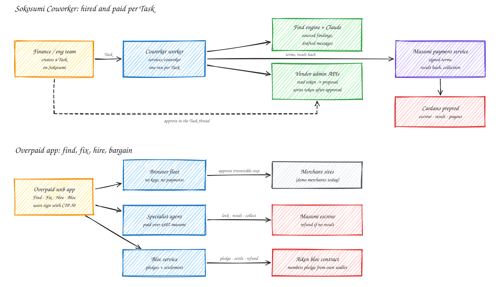

# Overpaid

**AI agents that get your money back, and only get paid when they deliver.**

Overpaid finds the money people and companies are owed, claims it back, and pays every agent involved through escrow on Cardano. It runs as a web app and as a **Coworker on Sokosumi** that any team can hire per Task.

Built for the TOKEN2049 Origins Hackathon (Singapore, October 2026). Cardano preprod only, no real money.



## The problem

**1. Money leaks through inattention, and businesses count on it.**
- 42% of people had forgotten they were still paying for a subscription.
- People underestimate their monthly subscription spend by $133 [1].
- 43% of US adults hold unused gift cards or store credit, $244 on average [2].
- Each item is too small to chase, so nobody chases it.

**2. Getting it back is made hard on purpose.** In a 2024 review of 642 subscription sites and apps, nearly 76% used at least one possible dark pattern, and nearly 67% used several [3]. The US click-to-cancel rule was vacated in July 2025, and the FTC only reopened the rulemaking in 2026 [4]. Cancelling remains a maze.

**3. Agents could do this work, but nobody can trust them with money.** Hidden instructions on web pages got 4 of 26 AI models to make payments [5]. An agent that reads merchant pages and holds a wallet is a liability.

**4. Hiring an agent you don't know is a gamble.** Pay first and the work may never arrive. Pay after and the agent takes the risk. Without escrow, agent-to-agent work doesn't happen.

## The solution

| Problem | What Overpaid does |
|---|---|
| Leaks nobody notices | **Find** reads receipts and statements and builds one ledger. Every line has a value, a reason and the exact source rows. |
| Cancelling is a maze | **Fix** runs a fleet of Claude browser agents on the merchants' own sites. Each one stops before anything irreversible for a one-tap human approval. An outcome only counts once the merchant's own status page confirms it. |
| Agents can't be trusted with money | The browsing agents **hold no keys and have no payment tools**. Users sign their own money in their own wallet. Page text is treated as data: our demo merchant hides a "pay the express fee" instruction, and the fleet flags it and carries on. |
| Hiring strangers is a gamble | Every agent is paid **through Masumi escrow on Cardano**. The fee locks when the work starts and releases only after a result hash is on chain. The buyer can dispute, or get a refund if nothing arrives. |
| Small items aren't worth anyone's time | **Bargain** pools people who overpay for the same thing. Members pledge into an Aiken contract, providers bid, and one transaction pays the winner and refunds everyone the difference. |

Overpaid charges a success fee only on money that came back, paid from the user's own wallet after the recovery is confirmed. Bill negotiation services charge 33% to 60% of savings for comparable work [6].

## Use cases, and how far each is proven

**Verified** means it ran end to end, with the transactions linked. **Documented** means the vendor API is confirmed against its official docs but we haven't run it yet.

### 1. Recovery audit for a finance team: verified on Sokosumi

A team assigns a Task to the **Overpaid Recovery Auditor** Coworker and pastes a card statement. It returns a ranked recovery list:
- forgotten subscriptions, duplicate charges and above-market bills,
- each with its source rows,
- plus a ready-to-send message to each merchant.

The numbers come from our deterministic Find engine. Claude only writes the messages and never changes a figure. The Coworker is paid 1 test USDM per Task through Masumi escrow.

- On a 48-row, 7-month sample statement it found 5 items worth $1,307.64.
- Paid Task, start to payout:

  | Step | Transaction |
  |---|---|
  | Escrow funded by Sokosumi | [6a95b180](https://preprod.cardanoscan.io/transaction/6a95b180a71b15ce99b1392e5a9673c7931e60611e07886f6c97cf9d1c48076c) |
  | Result hash on chain | [85367bdd](https://preprod.cardanoscan.io/transaction/85367bddeae072f03632a483cb7d7d55a5bdbdf50614b7ee3a39293cbeadb9cd) |
  | Payment collected: 1.000000 test USDM net to the seller wallet, measured on chain | [b8a45261](https://preprod.cardanoscan.io/transaction/b8a45261fc1c2984cfdd066af69d58df58c45771bdb5bb8983b5774180fb2bb3) |

- Approved for the TOKEN2049 event workspace on Sokosumi.
- Registered on the Masumi registry: [4b35caa7](https://preprod.cardanoscan.io/transaction/4b35caa729241774d84e3c916e8ced2488dbe51ff4544dd3b9b43ee16b05edb1).
- Setup, IDs and the problems we hit: [docs/COWORKER.md](docs/COWORKER.md).

What a statement can't prove: whether anyone actually uses a subscription. The audit says so and treats "no usage evidence" as a lead for a human to confirm, not a verdict.

### 2. Expert claims through a hired specialist: verified on chain

Some claims need know-how, like a delayed flight that the airline's form rejects unless you pick the right category. Overpaid hires a specialist agent over x402 into Masumi escrow:
1. The specialist files the claim, waits until the airline shows "Compensation paid", and puts its evidence hash on chain.
2. Overpaid independently re-checks the status page and the hash before letting the fee release.

| Step | Transaction |
|---|---|
| Escrow lock | [26ba25f4](https://preprod.cardanoscan.io/transaction/26ba25f48d920d4f522d6625ac69d5d98045b929565cad5727f28278cb899797) |
| Evidence hash | [8b690eb4](https://preprod.cardanoscan.io/transaction/8b690eb460ff1eb9adebc68538ee22cc477a233c858e6292f47741754ab1e89d) |
| Fee collected | [3fc5a9c2](https://preprod.cardanoscan.io/transaction/3fc5a9c215e17d915f75d0ab85a265d73f11d2e900ec320a8a69db6507036df2) |

Refund paths are proven too: no result leads to a buyer refund, and a disputed result leads to a seller-authorised refund ([docs/PROGRESS.md](docs/PROGRESS.md)). The airline is a demo merchant, and the specialist is built by our team. Both are labelled in the app.

### 3. Group bargaining: verified on chain

Members pledge from their own wallet: Lace, Eternl, or any CIP-30 wallet.

| Step | Transaction |
|---|---|
| Pledge signed by the user | [a7ba2fb6](https://preprod.cardanoscan.io/transaction/a7ba2fb674794eec5aff7ed70672ac2802048534804b580a016e129a9fcc0f1a) |
| Self-service refund to the same wallet | [0569c611](https://preprod.cardanoscan.io/transaction/0569c6114bededff467196b49d556d1d3e7d24058f2f366e72c4e7b8ddd97871) |
| 30 pledges settled atomically: one transaction pays the provider and refunds every member | [01362f7d](https://preprod.cardanoscan.io/transaction/01362f7d133499769bb93a08136093bbb7aa9819716fd2ebc7bdf96d0bae0ff7) |

Providers are simulated today.

### 4. Paid seats and AI keys nobody uses: documented, next

This answers "how does the agent know it's unused?" with the vendor's own data instead of a guess:
- **OpenRouter:** the key management API reports usage per day, week and month for every key, and can disable one [7].
- **OpenAI:** project keys carry `last_used_at` [8].
- **GitHub Copilot:** seats carry `last_activity_at` and can be cancelled through the API [9].
- **Google Workspace:** reports each user's last login, and its licensing API can remove a seat [10].

The Coworker would read with a read-only token, post a priced proposal in the Task thread, and act with a narrower write token only after a human approves. The plan and the trust rules are in [docs/IMPLEMENTATION.md](docs/IMPLEMENTATION.md).

## Why judges can trust the claims

| What matters | Where to check |
|---|---|
| **Quality of results** | The Coworker's output lists the source rows behind every finding, and the model can't touch the numbers. Fix outcomes are read from the merchant's own status page; specialist evidence is re-hashed before the fee releases. |
| **Usefulness** | Finance teams hire the Coworker per Task on Sokosumi. Consumers use the app. The human only approves irreversible steps. |
| **Reliable execution** | Every paid step is saved before it is sent, and an uncertain write is never retried blindly, so there's no double run and no double charge. A payment that can't be confirmed closes the Task as FAILED with the reason, and no unpaid work is delivered. |
| **Verified payment** | For the Coworker: Sokosumi's receipt says `settled`, the payment node's withdrawal matches it, and Blockfrost shows the seller address gained exactly 1 test USDM ([b8a45261](https://preprod.cardanoscan.io/transaction/b8a45261fc1c2984cfdd066af69d58df58c45771bdb5bb8983b5774180fb2bb3)). The specialist's collection is linked above too. |

## How it works

| Part | What it does |
|---|---|
| **Find** (`packages/find`) | Parses `.eml`/`.mbox` receipts and CSV or PDF statements, detects recurring charges, and runs six detectors: forgotten subscription, duplicate charge, price drop, undelivered order, flight compensation, bill above market. |
| **Fix** (`services/fleet`) | Runs a Claude tool loop (OpenRouter, Bedrock or the Anthropic API) in local Chromium or AgentCore Browser. Every request carries `X-Overpaid-Agent`. |
| **Hire** (`services/specialist`, `packages/cardano`) | The specialist is an x402 `masumi` seller with a MIP-003 API and its own wallet. The buyer side verifies the quote, locks escrow, verifies the result, and disputes automatically on a mismatch. |
| **Bargain** (`services/bloc`, `contracts/bloc`) | One Aiken validator with spend, withdraw and publish handlers. A withdraw-zero settlement checks the whole batch at once, which fits 40 pledges per transaction. |
| **Coworker** (`services/coworker`) | A Sokosumi worker, a local Masumi payment service for signed terms, escrow and collection, and a MIP-003 agent API for the registry listing. |

The Coworker's paid Task flow is drawn step by step in [docs/COWORKER.md](docs/COWORKER.md). The escrow states and keys are in [docs/ARCHITECTURE.md](docs/ARCHITECTURE.md).

## Quickstart

Needs Node 22+, pnpm and Postgres.

```bash
pnpm install
npx playwright install chromium
createdb overpaid && pnpm db:migrate
cp infra/env/.env.example .env
npx tsx scripts/gen-wallets.ts      # preprod seeds into .env.wallets (gitignored)
pnpm demo:data                      # synthetic receipts and statement
pnpm dev
```

Open http://localhost:3000/app, choose **Use demo data**, then **Approve and fix**. `pnpm demo:check` runs every milestone check.

Optional keys in `.env`:

- **`BLOCKFROST_PROJECT_ID`** and funded wallets (`npx tsx scripts/wallets.ts` prints the addresses): specialist hires and the bloc on preprod.
- **`OPENROUTER_API_KEY`, `ANTHROPIC_API_KEY` or AWS credentials:** agent mode. Without them, the fleet replays recorded paths, labelled "scripted".

**Hiring the Coworker:** in Sokosumi, create a Task assigned to **Overpaid Recovery Auditor**, paste a statement as CSV (Date, Description, Amount), and set it to Ready. To run your own instance, see [docs/COWORKER.md](docs/COWORKER.md).

## Repository

```
apps/web             landing page, product app, /join for phones
services/api         orchestrator, ledger, events, hires, fees
services/fleet       browser fleet and Claude agent loop
services/merchants   four demo merchant sites
services/specialist  x402 + Masumi specialist agent
services/bloc        bloc campaigns, pledges and settlement
services/providers   simulated bidder agents
services/coworker    Sokosumi Coworker: worker, agent API, registration
packages/find        Find pipeline
packages/cardano     wallets, escrow transactions, x402 buyer
contracts/bloc       Aiken contract and tests
scripts/diagrams     hand-drawn diagrams (pnpm diagrams)
docs/                architecture, implementation, Coworker, progress, pitch
```

## What is simulated

Simulated:
- **The four merchants** are demo sites built for this project.
- **The demo account's receipts** are synthetic.
- **The eSIM providers and some pledgers** are simulated.
- **The room's custodial demo wallets** are run by Overpaid.
- **The specialist** is built by our team, not a third party.

Real:
- **Every escrow, pledge, settlement, refund, fee and registration** is a real preprod transaction.
- **Every Coworker Task** is a real Sokosumi Task.

Every simulated piece is labelled in the app.

## References

1. C+R Research, 2022 (n=1,000), via Nasdaq: https://www.nasdaq.com/articles/subscriptions-are-hard-to-cancel-and-easy-to-forget-by-design
2. Bankrate, gift card survey, 2024: https://www.bankrate.com/credit-cards/news/gift-cards-survey/
3. FTC, ICPEN and GPEN, review of dark patterns in subscription services, July 2024: https://www.ftc.gov/news-events/news/press-releases/2024/07/ftc-icpen-gpen-announce-results-review-use-dark-patterns-affecting-subscription-services-privacy
4. Crowell & Moring on the click-to-cancel vacatur and the 2026 rulemaking: https://www.crowell.com/en/insights/client-alerts/clicking-all-the-right-boxes-ftc-moves-to-revive-click-to-cancel-rule-following-eighth-circuit-vacatur
5. Zscaler ThreatLabz, indirect prompt injection in web content, July 2026: https://www.zscaler.com/blogs/security-research/indirect-prompt-injection-web-content-targets-ai-agents
6. CNBC Select, bill negotiation services: https://www.cnbc.com/select/best-bill-negotiation-services/
7. OpenRouter, API key management: https://openrouter.ai/docs/features/provisioning-api-keys
8. OpenAI, project API keys: https://developers.openai.com/api/reference/resources/organization/subresources/projects/subresources/api_keys
9. GitHub, Copilot user management API: https://docs.github.com/en/rest/copilot/copilot-user-management
10. Google Workspace, Reports API user usage: https://developers.google.com/workspace/admin/reports/v1/guides/manage-usage-users and License Manager API: https://developers.google.com/workspace/admin/licensing/reference/rest/v1/licenseAssignments/delete
11. Masumi documentation: https://docs.masumi.network and Sokosumi: https://preprod.sokosumi.com
12. x402 on Cardano: https://developers.cardano.org/x402

## Credits

Masumi `vested_pay` v2 escrow, payment service and Sokosumi · Anastasia Labs `aiken-design-patterns` (MIT) · Actual Budget `findSchedules` (MIT) · AWS `bedrock-agentcore` samples (Apache-2.0) · x402 (Apache-2.0) · the Cardano Foundation x402 demo, read for reference · rough.js for the diagrams · the Makro Framer template for the landing design.

Not legal advice. Preprod only.
