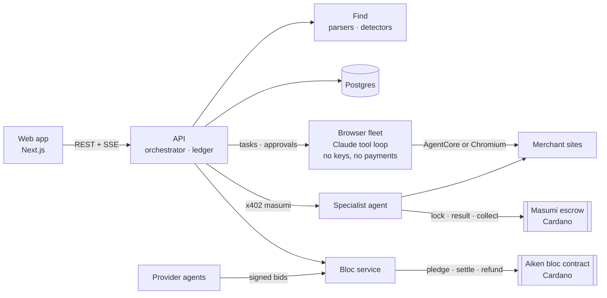

# Overpaid

**AI agents that get your money back.**

Overpaid reads your receipts and card statement, finds the money businesses keep from people too busy to chase it, and claims it back on the merchants' own websites. Claims that need expertise go to a specialist agent paid through escrow on Cardano. People who overpay for the same thing bargain as a group, with pledges locked on chain.

Built for the TOKEN2049 Origins Hackathon (Singapore, October 2026). Cardano preprod only, no real money.

## How it works

| | |
|---|---|
| **Find** | Parses `.eml`/`.mbox` receipts and a CSV or PDF statement, detects recurring charges, and builds one ledger: every line has a value, a reason and its source records. |
| **Fix** | A fleet of browser agents works the ledger in parallel on the merchants' own sites. Irreversible steps wait for a one-tap approval. Every outcome is verified on the merchant's status page and saved as a hashed evidence bundle. |
| **Hire** | Hard claims go to a specialist agent paid over **x402** into **Masumi** escrow. It submits its evidence hash on chain. The fee releases at unlock time unless Overpaid disputes first, and Overpaid re-checks the evidence and disputes automatically if it doesn't match. |
| **Bargain** | Members lock refundable pledges in an **Aiken** contract from their own wallet. Providers send signed bids. One transaction pays the winner and refunds every member the difference; after the deadline anyone can refund a pledge. |
| **Fee** | Overpaid takes a success fee only on money that came back, paid by the user from their own wallet after the recovery is confirmed. |

## Architecture



The browsing agents hold no keys and have no payment tools. Payments happen only in the API and the bloc service. Web pages are treated as data, never instructions, and every agent request identifies itself as an agent acting for its user. More in [docs/ARCHITECTURE.md](docs/ARCHITECTURE.md).

## Stack

TypeScript on Node 22, pnpm workspaces · Next.js 16, React 19 · Fastify, Drizzle, Postgres · Playwright, Amazon Bedrock AgentCore Browser, Claude (Bedrock or Anthropic API) · `@x402/cardano`, Evolution SDK, Masumi `vested_pay` v2 · Aiken (Plutus V3).

## Quickstart

```bash
pnpm install
npx playwright install chromium
createdb overpaid && pnpm db:migrate     # or: docker compose -f infra/docker-compose.yml up -d
cp infra/env/.env.example .env
npx tsx scripts/gen-wallets.ts           # three preprod seeds into .env.wallets (gitignored)
pnpm demo:data                            # synthetic receipts and statement
pnpm dev
```

Open http://localhost:3000/app, choose **Use demo data**, then **Approve and fix**. `pnpm demo:check` runs every milestone check.

Optional keys in `.env`:

- `BLOCKFROST_PROJECT_ID` and funded wallets (`npx tsx scripts/wallets.ts` prints addresses): specialist hires and the bloc on preprod.
- AWS credentials (`ap-southeast-1`) or `ANTHROPIC_API_KEY`: agent mode and AgentCore browsers. Without them the fleet runs recorded paths, labelled "scripted".

## Repository

```
apps/web             landing page and product app
services/api         orchestrator, events, ledger, hires
services/fleet       browser fleet and agent loop
services/merchants   four demo merchant sites
services/specialist  x402 + Masumi specialist agent
services/bloc        bloc campaigns and settlement
services/providers   simulated bidder agents
packages/find        Find pipeline
packages/cardano     wallets, escrow transactions, x402 buyer
contracts/bloc       Aiken contract and tests
docs/                architecture, runbook, pitch, decisions
```

## What is simulated

The four merchants are demo sites built for this project, the demo account's receipts are synthetic, the eSIM providers and some pledgers are simulated, and the first specialist is built by the Overpaid team. Each is labelled in the app.

## Credits

Masumi `vested_pay` v2 escrow · Anastasia Labs `aiken-design-patterns` (MIT) · Actual Budget `findSchedules` (MIT) · AWS `bedrock-agentcore` samples (Apache-2.0) · x402 (Apache-2.0) · the Cardano Foundation x402 demo, read for reference · the Makro Framer template for the landing design.

Not legal advice. Preprod only.
