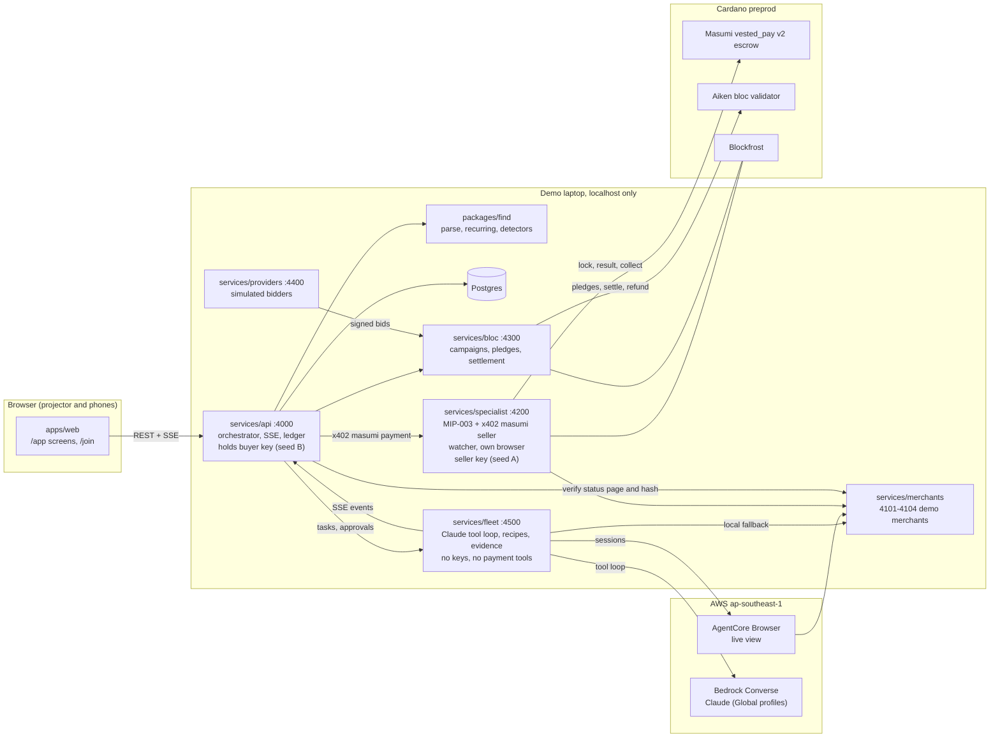
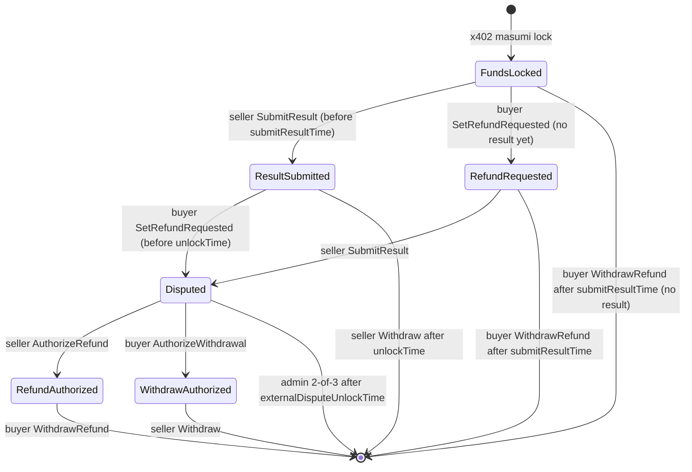

# Architecture

## Components

## Flows

1. **Find.** `POST /api/find/run` calls `runFind()` on the demo dataset or uploaded exports (parsed in memory, never written to disk). Opportunities, transactions and per-line source labels are stored; `money.found` updates every screen.
2. **Fix.** `POST /api/fix` maps each ledger line to a recipe and posts a task to the fleet. The fleet runs a session per task (AgentCore when configured, local Chromium otherwise), in agent mode when a model is available and the recorded scripted path otherwise. An irreversible step pauses the task with a screenshot; the API stores the approval and forwards the decision. The outcome is read from the merchant's own status page in a fresh page, and the evidence manifest (RFC 8785 canonical JSON, SHA-256) is written under `evidence/<taskId>/`. Money counts as recovered only when the status page shows it.
3. **Specialist hire.** The API pays over x402 (`masumi` method) from the buyer wallet. The quote must commit to exactly the body we sent and pay the canonical escrow address. The specialist's watcher sees the lock, matches every datum field against the terms it signed, files the claim in its own browser, waits for "Compensation paid", writes the evidence bundle, and submits its hash with `SubmitResult`. The API independently re-reads the airline's status page and recomputes the evidence hash; only then does the claim count. The specialist collects with `Withdraw` after `unlockTime`.
4. **Bloc.** A campaign NFT and campaign datum are locked at the bloc address; members pledge into the same address with a pledge datum; providers sign bids over a fixed byte layout; the settlement transaction spends up to `N_max` pledges, pays the provider at output 0 and refunds each member at outputs 1 to N in pledge order.

## Escrow state machine (Masumi vested_pay v2, as deployed on preprod)

Every action has a 7 minute cooldown per party and needs a finite validity upper bound. The validator enforces no protocol fee. Sources: `docs/research/vested-pay-v2.md`.

## Bloc contract

One multi-handler validator (`spend`, `withdraw`, `publish`) parameterised by the campaign policy id, so all handlers share one hash (DECISIONS D9). Settlement uses the withdraw-zero pattern: every pledge spend requires the bloc's own withdrawal in the same transaction, where one check covers the whole batch. Measured cost per pledge is about 0.33M memory units; 40 pledges use about 71% of the 17.5M limit, so `N_max` defaults to 40 until preprod confirms it. Details: `contracts/bloc/README.md`.

## Trust model

- **Keys.** Four seeds. Seed A (treasury, bloc admin) never runs on a tunnelled host. Seed S belongs to the specialist alone; its process reads a wallets file holding only seed S. Seed B (Overpaid's agent wallet that pays specialists, providers) runs in the API. Seed C (custodial demo room wallets) holds only enough for one pledge each.
- **Users sign their own money.** Bloc pledges and success fees are built by the server and signed in the user's CIP-30 wallet; the server only merges the wallet's witnesses into the body it built and re-validates before submitting. Pledge refunds go to the user's own address, and after the deadline anyone (including the user, from the app) can build the refund. A ticker refunds every remaining pledge automatically once the deadline passes.
- **Operator actions are guarded.** Every API write needs a client header (blocks cross-site requests from other origins), and anything that spends Overpaid's own funds or resets state needs the operator token.
- **The browsing agent cannot pay.** The fleet holds no key and has no payment or evaluate tool; it runs in its own process. Payments happen only in the API and the bloc service, through structured flows.
- **Web pages are data.** The system prompt says so; page text asking for payment or off-allowlist navigation is flagged, off-allowlist requests are blocked at the route level, and one demo page carries a hidden injection the fleet visibly ignores.
- **Agents announce themselves.** Every request carries `X-Overpaid-Agent`; with AgentCore Web Bot Auth enabled, requests are signed and the demo merchants show "Request from an AI agent acting for its user".
- **Verification never trusts an agent's own claim.** Outcomes are read from merchants' status pages; specialist results are re-checked before Overpaid stays silent and lets the fee release.
- **Non-custodial by design for users:** pledges sit in a script Overpaid holds no key to, and anyone can build the refund after the deadline. The room's demo wallets are custodial and labelled.
