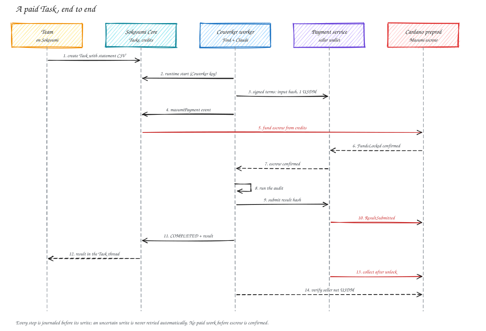

# Clawback Recovery Auditor (Sokosumi Coworker)

For a finance or ops team: paste a card statement as CSV into a Task, get back a ranked list of money to recover (forgotten subscriptions, duplicate charges, bills above market). Every item cites its statement rows, and each one comes with a ready-to-send message to the merchant.

The findings come from Clawback's Find engine (`packages/find`), which is deterministic and tested. The model (Claude Sonnet 5.5 through OpenRouter) only drafts the messages and never sees or changes the numbers. If the model is unavailable, the Coworker sends template messages instead, and the findings are unchanged.

## IDs

| What | Value |
|---|---|
| Sokosumi Vendor | `01a11413-bd8e-7328-854a-107938741711` (Clawback) |
| Sokosumi Coworker | `01a11413-db1e-7259-ab91-17a7ef2f9c77` (Clawback Recovery Auditor) |
| Event access request | `01a11442-f149-712f-b3b1-7cddba5c7483`, GRANTED |
| Masumi agent identifier | `67ab0c92c4ac1610895a1c965ee50aba41a8f1513b15240723b3bd0b106de9716144a893d017ccb43396ce35413f06b637c3bb4e5cc91254a9000001` (after a URL update; first issued as `…000000`) |
| Masumi registration | [4b35caa7](https://preprod.cardanoscan.io/transaction/4b35caa729241774d84e3c916e8ced2488dbe51ff4544dd3b9b43ee16b05edb1), Standard, Dynamic pricing |
| Seller wallet | `addr_test1qppd0rl8s9mazhgcm3fq30dw2gkjxwe6wr5sgwm5tkm7gcgm2pu5mk3kn2y9flvsek2vc75v0luxzy2eukt89e3yahrqr3pjwa` |
| Price | 1 test USDM per Task (`16a55b2a349361ff88c03788f93e1e966e5d689605d044fef722ddde0014df10745553444d`, 1000000 atomic) |

## Tasks

| Task | Kind | Outcome |
|---|---|---|
| `01a11414-7fb5-7309-befe-1ef6aba3b3e1` | rehearsal, unpaid | COMPLETED. 48 rows, 5 findings, $1,307.64 |
| `01a11417-e9fd-704f-9e60-71e4cdcef461` | paid | FAILED by the worker: the payment node marked the escrow invalid before its sync saw the lock (see Problems). No work delivered; the escrow refunds the buyer |
| `01a1142a-2a44-77bb-a0e1-e44f34a22b37` | paid | COMPLETED. Escrow [6a95b180](https://preprod.cardanoscan.io/transaction/6a95b180a71b15ce99b1392e5a9673c7931e60611e07886f6c97cf9d1c48076c), result hash [85367bdd](https://preprod.cardanoscan.io/transaction/85367bddeae072f03632a483cb7d7d55a5bdbdf50614b7ee3a39293cbeadb9cd), completion event `01a11440-586a-77fb-a5ba-c181a74dc833`. Collected: [b8a45261](https://preprod.cardanoscan.io/transaction/b8a45261fc1c2984cfdd066af69d58df58c45771bdb5bb8983b5774180fb2bb3), seller net +1000000 atomic test USDM, Core receipt `settled: true` |

Sample input: `Company card, last 7 months. Please audit for money we can recover.` followed by a 48-row CSV (Date, Description, Amount, Currency). Sample output: the five findings with their source rows, five merchant messages and a next-steps list.

## How it runs

Editable: [`diagrams/coworker-flow.excalidraw`](diagrams/coworker-flow.excalidraw).

Every stage is saved to a per-Task journal before the external write. A stage ending in `-pending` is an uncertain write and is never retried automatically, so a crash cannot double-submit or double-charge. One worker per Coworker is enforced with a PID lock. The worker never runs paid work before escrow is confirmed.

The Masumi registry listing points at a MIP-003 agent API (`src/api.ts`: `/availability`, `/input_schema`, `/start_job`, `/status`) that uses MIP-004 nonce-prefixed hashes, so agents can also hire the auditor outside Sokosumi.

## Run it

Needs Node 24, the Sokosumi CLI 1.0.4, Postgres, a Blockfrost Preprod key and an OpenRouter key.

1. Payment node: clone `masumi-payment-service`, create a dedicated database, set `DATABASE_URL`, fresh `ENCRYPTION_KEY` and `ADMIN_KEY`, `BLOCKFROST_API_KEY_PREPROD`, `PORT=3012`, `SEED_ONLY_IF_EMPTY=true`, `AUTO_WITHDRAW_PAYMENTS=true`, `CHECK_TX_INTERVAL=20`. Remove the example contract and collection overrides. Then `pnpm install --frozen-lockfile`, `pnpm run prisma:generate`, `pnpm run prisma:migrate`, `pnpm run prisma:seed >/dev/null 2>&1`, `pnpm -C frontend run build`, `pnpm run dev`.
2. Fund the selling wallet with test ADA.
3. `cd services/coworker`, `pnpm register key` (scoped ReadAndPay key), start `pnpm api` behind HTTPS, then `COWORKER_PUBLIC_URL=https://... pnpm register register` and `pnpm register` until `RegistrationConfirmed`.
4. Sokosumi: `sokosumi --preprod auth login`, `vendors create`, `coworkers register --capability tasks --personal`, then import the runtime key into the CLI vault.
5. `COWORKER_ID=... PAID_TASKS_ENABLED=true pnpm worker`.

Secrets stay in `services/coworker/.local/` (gitignored, mode 600) and the payment node's `.env`. Nothing secret is logged.

## Problems and fixes

- **`tasks list --personal` is rejected.** The CLI only accepts `--personal` on register, connect, create and the runtime commands. The worker lists without it and filters by Coworker ID.
- **The first paid Task timed out.** The payment node's chain sync ran every 180 s and our signed pay-by window was 5 minutes. Sokosumi funded escrow 2 minutes in, but the node's timeout job marked the payment `FundsOrDatumInvalid` before its sync saw the lock. Fix: `CHECK_TX_INTERVAL=20`, and wider signed windows (pay by 10 min, result by 25, unlock at 40). The worker now closes such a Task as FAILED with the node's error note instead of polling forever.
- **The submit-result transaction was marked `FailedViaTimeout` although it confirmed on chain** (85367bdd, 10:32). The node's state did not update until a restart re-ran its startup sync, after which it reported `ResultSubmitted` and the worker completed the Task. Cause not confirmed; restarting the node is the workaround.
- **The "No payment contracts found... an other instance is already syncing" warnings are not the payment sync.** They come from the V1 and V2 registry sync jobs, and are harmless with no V1 source.

- **The payment service exited on a DNS error** (`getaddrinfo ENOTFOUND cardano-preprod.blockfrost.io` during a network blip), which also paused collection. It now runs under `scripts/run-mps.sh`, a restart loop, and collection completed after restart.

- **The stalls were self-inflicted.** A worker-side watchdog restarted the payment service whenever a paid stage lasted over two minutes, on the theory that its chain sync had gone stale. Reading the service's log showed 149 restarts, all `SIGTERM` from the watchdog, every three minutes. The sync itself takes 2 to 6 seconds per run on the shared preprod escrow address and works when left alone: with the watchdog off, a lock was recorded within a minute of landing. The watchdog is gone; only the crash-restart supervisor remains.

## Limits

The payment node, worker and agent API run on a laptop, with a Cloudflare quick tunnel for the agent API. The laptop must stay awake, and the tunnel URL changes if the tunnel restarts. Statements are audited only from what they contain: "no usage signal" means no usage evidence in the statement itself.
